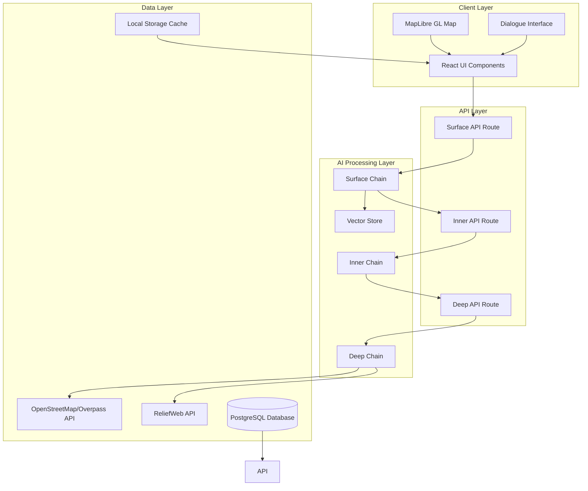

# Design Document

## Overview

TRIDENT is an Interactive Smart Maps Assistant that leverages a sophisticated three-layer AI architecture to transform natural language queries into dynamic, interactive map visualizations. The system integrates OpenStreetMap data, AI-powered natural language processing, and real-time map rendering to provide users with an intuitive geographic exploration experience.

The architecture follows a clear separation of concerns with the Surface Layer handling user interaction and ability selection, the Inner Layer processing dialogue context and generating intermediate representations, and the Deep Layer executing geospatial queries and data retrieval. This design enables scalable AI processing, efficient caching, and modular component development.

## Architecture

### System Architecture Diagram



### Three-Layer AI Architecture

#### Surface Layer
- **Purpose**: User interaction management and ability selection
- **Input**: Natural language queries and dialogue history
- **Output**: Ability determination (overpass-api, apology, ask-more) and user responses
- **Implementation**: LangChain-based chain with vector store for context retrieval

#### Inner Layer
- **Purpose**: Dialogue processing and intermediate representation generation
- **Input**: Conversation history and map context (bounds, center)
- **Output**: TRIDENT Intermediate Language specifications with styling and map metadata
- **Implementation**: Context-aware processing with map-specific prompt engineering

#### Deep Layer
- **Purpose**: Geospatial query execution and data retrieval
- **Input**: TRIDENT Intermediate Language specifications
- **Output**: Overpass API queries and processed GeoJSON data
- **Implementation**: Query generation with caching and error handling

## Components and Interfaces

### Core Components

#### BaseMap Component
```typescript
interface BaseMapProps {
  id?: string;
  mapRef: MutableRefObject<MapRef | null>;
  longitude: number;
  latitude: number;
  zoom: number;
  children?: ReactNode;
  style?: string | StyleSpecification;
  onMapLoad?: () => void;
  onMapMoveEnd?: (e: ViewStateChangeEvent) => void;
  enableInteractions?: boolean;
}
```

**Responsibilities:**
- MapLibre GL map initialization and configuration
- Map event handling (load, move, zoom)
- Control integration (navigation, geolocation, attribution)
- Style management and switching

#### DialogueElementView Component
```typescript
interface DialogueElement {
  who: "user" | "assistant";
  text: string;
}

interface DialogueElementViewProps {
  dialogueElement: DialogueElement;
  dialogueIndex: number;
  isResponding: boolean;
}
```

**Responsibilities:**
- Chat message rendering with role-based styling
- Loading state management during AI processing
- Message history display and scrolling

#### GeoJsonToSourceLayer Component
```typescript
interface GeoJsonToSourceLayerProps {
  geojson: FeatureCollection;
  style: TridentMapsStyle;
}

interface TridentMapsStyle {
  emoji?: string;
  color?: string;
}
```

**Responsibilities:**
- GeoJSON data visualization on map
- Dynamic styling based on data categories
- Layer management and rendering optimization

### API Interfaces

#### Surface API Route
```typescript
interface SurfaceRequest {
  query: string;
  pastMessages?: string;
  bounds?: string;
  center?: string;
}

interface SurfaceResponse {
  query: string;
  surface: string;
  history: string[];
}
```

#### Inner API Route
```typescript
interface InnerRequest {
  pastMessages: string;
  bounds?: string;
  center?: string;
}

interface InnerResponse {
  inner: string; // TRIDENT Intermediate Language
}
```

#### Deep API Route
```typescript
interface DeepRequest {
  query: string; // Area with concern specification
}

interface DeepResponse {
  deep: string; // Overpass API query
}
```

### State Management

#### Main Application State
```typescript
interface AppState {
  // Map state
  geoJsonWithStyleList: GeoJsonWithStyle[];
  center: LngLatLike | undefined;
  bounds: LngLatBoundsLike | undefined;
  mapStyleJsonUrl: string;
  
  // Dialogue state
  dialogueList: DialogueElement[];
  responding: boolean;
  mapping: boolean;
  
  // UI state
  showingFloatingChat: boolean;
  inputText: string;
  ability: Ability | undefined;
  
  // Localization
  mapInputPlaceholder: string;
  pageTitle: string;
  mapTitle: string;
}
```

## Data Models

### Core Data Types

#### GeoJSON Processing
```typescript
interface GeoJsonWithStyle {
  id: string;
  line: string; // Original query specification
  style: TridentMapsStyle;
  geojson: FeatureCollection;
}
```

#### AI Chain Models
```typescript
interface ChainInput {
  input: string;
  bounds?: LngLatBoundsLike;
  center?: LngLatLike;
}

interface ChainOutput {
  text: string;
  metadata?: Record<string, any>;
}
```

#### User Authentication
```typescript
interface User {
  id: string;
  name?: string;
  email?: string;
  role: string;
  createdAt: DateTime;
  updatedAt: DateTime;
}
```

#### JGeoGLUE Quiz System
```typescript
interface JGeoGLUETask {
  id: string;
  type: string;
  question: string;
  correctAnswer: string;
  createdAt: DateTime;
  updatedAt: DateTime;
}

interface JGeoGLUEAnswer {
  taskId: string;
  userId: string;
  answer: string;
  isCorrect: boolean;
  createdAt: DateTime;
  updatedAt: DateTime;
}
```

### Database Schema

The system uses PostgreSQL with Prisma ORM for data persistence:

- **Users**: Authentication and profile management
- **Sessions/Accounts**: NextAuth.js integration for session handling
- **JGeoGLUE Tasks/Answers**: Educational quiz system with progress tracking
- **Vector Storage**: pgvector extension for AI embeddings and similarity search

## Error Handling

### AI Processing Errors

#### Chain Execution Failures
```typescript
try {
  const result = await chain.invoke(input);
  return result;
} catch (error) {
  console.error("Chain execution failed:", error);
  return {
    text: "I apologize, but I'm having trouble processing your request. Please try again.",
    ability: "apology"
  };
}
```

#### API Integration Errors
```typescript
const handleOverpassError = (error: Error) => {
  if (error.message.includes("timeout")) {
    return "The query is taking too long. Please try a more specific request.";
  }
  if (error.message.includes("rate limit")) {
    return "Too many requests. Please wait a moment before trying again.";
  }
  return "Unable to retrieve map data. Please check your query and try again.";
};
```

### Map Rendering Errors

#### GeoJSON Processing
```typescript
const validateGeoJson = (geojson: any): FeatureCollection | null => {
  try {
    if (!geojson || geojson.type !== "FeatureCollection") {
      throw new Error("Invalid GeoJSON format");
    }
    return geojson as FeatureCollection;
  } catch (error) {
    console.error("GeoJSON validation failed:", error);
    return null;
  }
};
```

#### Map Bounds Calculation
```typescript
const safeFitBounds = (mapRef: MapRef, geojson: FeatureCollection) => {
  try {
    if (geojson.features.length === 0) {
      console.warn("No features to fit bounds");
      return;
    }
    fitBoundsToGeoJson(mapRef, geojson, padding);
  } catch (error) {
    console.error("Failed to fit bounds:", error);
    // Fallback to default view
    mapRef.current?.flyTo({ center: [0, 0], zoom: 1 });
  }
};
```

### User Input Validation

#### Query Sanitization
```typescript
const sanitizeQuery = (input: string): string => {
  return input
    .trim()
    .replace(/[<>]/g, "") // Remove potential HTML
    .substring(0, 1000); // Limit length
};
```

#### Authentication State Handling
```typescript
const requireAuth = (handler: Function) => {
  return async (req: Request) => {
    const session = await getServerSession(req);
    if (!session) {
      return NextResponse.json({ error: "Unauthorized" }, { status: 401 });
    }
    return handler(req, session);
  };
};
```

## Testing Strategy

### Unit Testing

#### Component Testing
```typescript
describe("BaseMap Component", () => {
  test("renders map with correct initial view", () => {
    render(<BaseMap {...defaultProps} />);
    expect(screen.getByRole("region")).toBeInTheDocument();
  });
  
  test("handles map move events", () => {
    const onMoveEnd = jest.fn();
    render(<BaseMap {...defaultProps} onMapMoveEnd={onMoveEnd} />);
    // Simulate map interaction
    fireEvent.click(screen.getByRole("region"));
    expect(onMoveEnd).toHaveBeenCalled();
  });
});
```

#### AI Chain Testing
```typescript
describe("Surface Chain", () => {
  test("processes valid geographic query", async () => {
    const chain = await loadTridentSurfaceChain({ llm, vectorStore });
    const result = await chain.invoke({ input: "Show me parks in Tokyo" });
    expect(result.text).toContain("overpass-api");
  });
  
  test("handles ambiguous queries", async () => {
    const chain = await loadTridentSurfaceChain({ llm, vectorStore });
    const result = await chain.invoke({ input: "Show me stuff" });
    expect(result.text).toContain("ask-more");
  });
});
```

### Integration Testing

#### API Route Testing
```typescript
describe("/api/ai/surface", () => {
  test("processes query and returns valid response", async () => {
    const response = await POST(new Request("http://localhost", {
      method: "POST",
      body: JSON.stringify({ query: "restaurants in Paris" })
    }));
    
    const data = await response.json();
    expect(data.surface).toBeDefined();
    expect(data.history).toBeInstanceOf(Array);
  });
});
```

#### Database Integration
```typescript
describe("JGeoGLUE Quiz System", () => {
  test("creates and retrieves quiz answers", async () => {
    const task = await prisma.jGeoGLUETask.create({
      data: { type: "geography", question: "Capital of France?", correctAnswer: "Paris" }
    });
    
    const answer = await prisma.jGeoGLUEAnswer.create({
      data: { taskId: task.id, userId: "test-user", answer: "Paris", isCorrect: true }
    });
    
    expect(answer.isCorrect).toBe(true);
  });
});
```

### End-to-End Testing

#### User Journey Testing
```typescript
describe("Map Creation Flow", () => {
  test("user can create map from natural language query", async () => {
    // Navigate to application
    await page.goto("/");
    
    // Enter query
    await page.fill('[data-testid="query-input"]', "coffee shops in Seattle");
    await page.click('[data-testid="submit-button"]');
    
    // Wait for AI processing
    await page.waitForSelector('[data-testid="map-layer"]');
    
    // Verify map contains data
    const mapLayers = await page.locator('[data-testid="map-layer"]').count();
    expect(mapLayers).toBeGreaterThan(0);
  });
});
```

### Performance Testing

#### Load Testing
```typescript
describe("Performance Benchmarks", () => {
  test("AI chain response time under 10 seconds", async () => {
    const startTime = Date.now();
    const result = await surfaceChain.invoke({ input: "parks in London" });
    const endTime = Date.now();
    
    expect(endTime - startTime).toBeLessThan(10000);
  });
  
  test("map rendering with large datasets", async () => {
    const largeGeoJson = generateLargeGeoJson(10000); // 10k features
    const startTime = Date.now();
    
    render(<GeoJsonToSourceLayer geojson={largeGeoJson} style={defaultStyle} />);
    
    const endTime = Date.now();
    expect(endTime - startTime).toBeLessThan(5000);
  });
});
```

### Accessibility Testing

#### Screen Reader Compatibility
```typescript
describe("Accessibility", () => {
  test("map has proper ARIA labels", () => {
    render(<BaseMap {...defaultProps} />);
    expect(screen.getByRole("region")).toHaveAttribute("aria-label");
  });
  
  test("dialogue interface is keyboard navigable", () => {
    render(<DialogueElementView {...defaultProps} />);
    const chatInput = screen.getByRole("textbox");
    expect(chatInput).toHaveAttribute("tabindex", "0");
  });
});
```